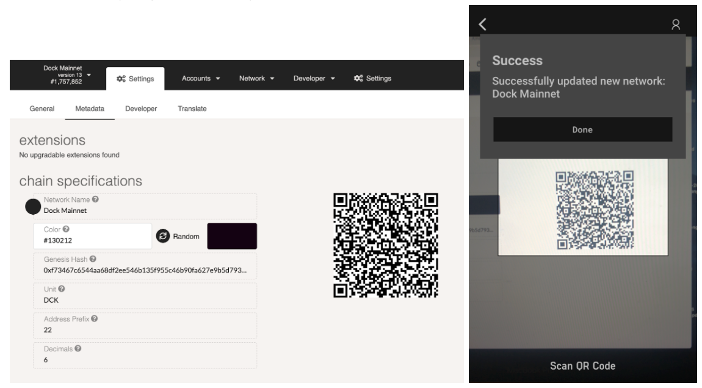

# Wallets and Account Creation

## Polkadot Browser Extension

Polkadot provides browser extension that manages accounts and allows signing of transactions, it cannot be used for sending funds. The extension works alongside polkadot applications similar to Metamask’s browser extension for Ethereum. More information about the extension can be found [here](https://github.com/polkadot-js/extension).

1. Download the app for your browser via [Chrome web store](https://chrome.google.com/webstore/detail/polkadot%7Bjs%7D-extension/mopnmbcafieddcagagdcbnhejhlodfdd) or [Firefox add-ons](https://addons.mozilla.org/en-US/firefox/addon/polkadot-js-extension/).
2. Once the app is installed, go to the app in your browser and click the + icon to add your account, then follow the steps to set up your account.

**Important:** save the mnemonic seed in a safe, offline place. This is required to restore access to your account.

3. Next click on the three dots next to your account and select Dock PoS Mainnet in the dropdown.

4. Once setup is complete, you will be able to view your account address in the browser extension app.

## Dock Polkadot-JS App

Dock has forked and customized the well-tested, browser-based wallet that is also used for Polkadot. This is a browser-based application, so it is not as secure as using an offline option.


Consider storing your account in a signer such as the Polkadot browser extension or the Parity wallet for optimal account security. Future versions of this web app will only support these external sources.


1. Go to [https://fe.dock.io/\#/accounts](https://fe.dock.io/#/accounts) and check the top left corner that you are on Dock’s mainnet. If not, then click on the network name, click on **Live Networks &gt; Dock**, and click **Switch**. 

2. Click on **+ Add Account** and complete the name and password fields, then click Next and Save. 

**Important:** save the mnemonic seed in a safe, offline place. This is required to restore access to your account.

3. To view your Dock token address, go to the Accounts page and click on the name of the account. Your token address will appear on the right side of the page.

## Parity Signer

Parity Signer is a secure way of storing your DOCK tokens on an offline device like an old smartphone or tablet. This is an app available on iOS and Android that can be used for key storage and signing transactions. For maximum security, ensure the device will always be kept offline.

1. Download Parity Signer here: [https://www.parity.io/signer](https://www.parity.io/signer). Open the app, click Create and follow the setup instructions.
2. In the app, check that there is no red "unshielded" icon in the top-right, if you see the red shield then turn off wifi, data, bluetooth or any other communication networks to ensure maximum security.

3. Go to [https://fe.dock.io/\#/settings/metadata](https://fe.dock.io/#/settings/metadata) and check that the top left corner shows “Dock Mainnet”, so that you know you are on Dock’s mainnet. If not, then click on the network name, click on Live Networks &gt; Dock, and click Switch. 

4. If you are not there already, go to [Settings &gt; Metadata](https://fe.dock.io/?rpc=wss%3A%2F%2Fmainnet-node.dock.io#/settings/metadata) and you will see a QR code. Open the Parity Signer app on your device, click on QR scanner and scan the QR code. 

5. Now you will see the Dock Mainnet in the available network list on the app. Click on +Derive New Account and you will see a new account created for Dock.

## Ledger Nano S Hardware Wallet \(_Experimental_\)

Ledger’s hard wallet provides a very secure solution for storing your tokens. If you are purchasing the hardware wallet, make sure to purchase directly from the Ledger’s [website](https://shop.ledger.com/products/ledger-nano-s) or [amazon store](https://smile.amazon.com/Ledger-Nano-Hardware-Bitcoin-Ethereum/dp/B07FY5R77T/).

_Our Ledger app has been published on Ledger Live but it is still under security review._   
To install the app, activate developer mode in [Ledger Live](https://www.ledger.com/ledger-live) at  _Settings_ -&gt; _Experimental features_ -&gt; _Developer mode_. Now search for  Dock in Ledger Live. You will see 2 apps, **Dock** and **Dock XL** where **Dock XL** is a bigger but more feature-rich app like supporting governance where **Dock** is a lighter app and supports basic features like transfer and staking. Install an appropriate app.  
When you open the app, you will see "Pending Ledger review", press both buttons \(on Nano S\) to enter the app. Now you can follow [this user guide](https://github.com/LedgerHQ/app-dock/blob/main/docs/User%20guide.md) to use the app.  
****

