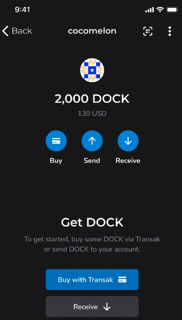

# How to Buy Dock

You can buy Dock Tokens from the Dock Wallet or using cryptocurrency exchanges.&#x20;

### 1) Buy from the Dock Wallet With Fiat

Buy Dock tokens directly from the [Dock Wallet app](https://www.dock.io/dock-wallet-app) using our Transak integration. You can buy DOCK with bank transfers and card payments using Transak after you complete their KYC process.

1. In your Dock Wallet, click on "Buy with Transnak"&#x20;

2\. Continue to Transak and it will take you to the interface below. Select the currency and DOCK in the crypto dropdown. The amount will automatically tell you how many DOCKs you will be getting.

<figure><figcaption></figcaption></figure>

3\. Complete the email verification process. Once the verification is complete, enter your personal details and complete the KYC verification process.&#x20;

<figure><figcaption></figcaption></figure>

4\. Go back to the Buy Crypto screen and enter the amount. The app will take you to the screen below. Enter the address of your wallet in the Dock app and the screen will show you the amount of DOCK you will receive in your wallet.

5\. Add your credit/debit card or bank account information. Click "Continue."

6\. Once you do, the interface will redirect you to your bank’s portal to complete the payment.

### 2) Buy on Crypto Exchanges With Other Cryptocurrencies

DOCK token is available on the world’s leading cryptocurrency exchanges like [Binance](https://www.binance.com/en/trade/DOCK\_USDT?ref=H31B921U), [Huobi](https://www.huobi.com/en-us/exchange/dock\_usdt/), [Kucoin](https://trade.kucoin.com/DOCK-BTC), and [Gate](https://www.gate.io/trade/DOCK\_USDT). If you hold other leading crypto like Bitcoin and stablecoins like USDT, you can trade DOCK on these exchanges.&#x20;

**To buy DOCK on Binance:**

1. Login on your Binance account&#x20;
2. Search for the [DOCK/USDT](https://www.binance.com/en-IN/trade/DOCK\_USDT) or [DOCK/BTC](https://www.binance.com/en-IN/trade/DOCK\_BTC?theme=dark\&type=spot) pair &#x20;
3. Buy DOCK by placing market or limit orders on the trading platform
