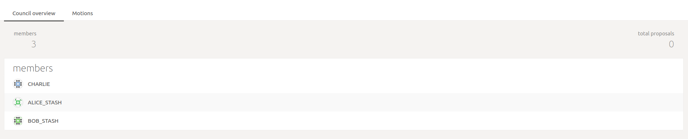
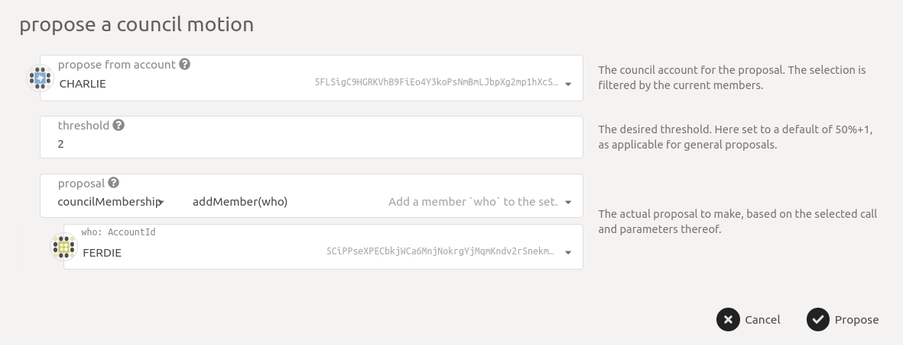
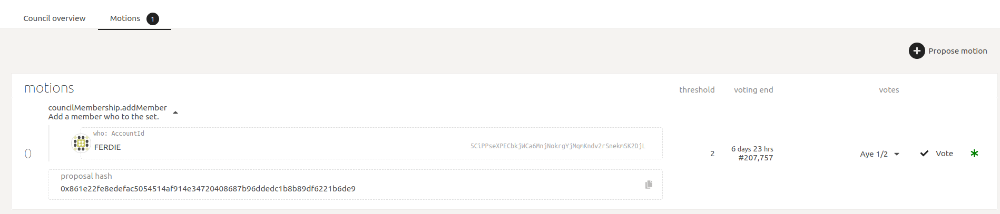
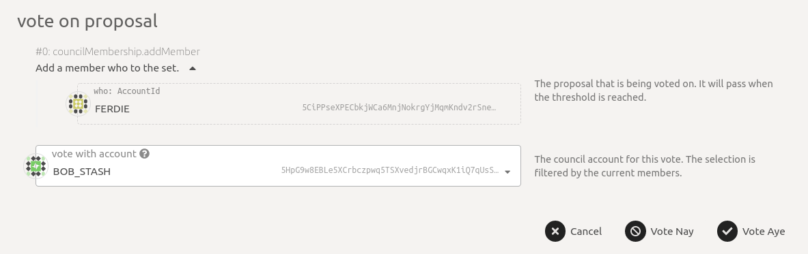
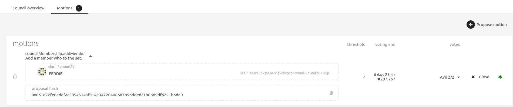
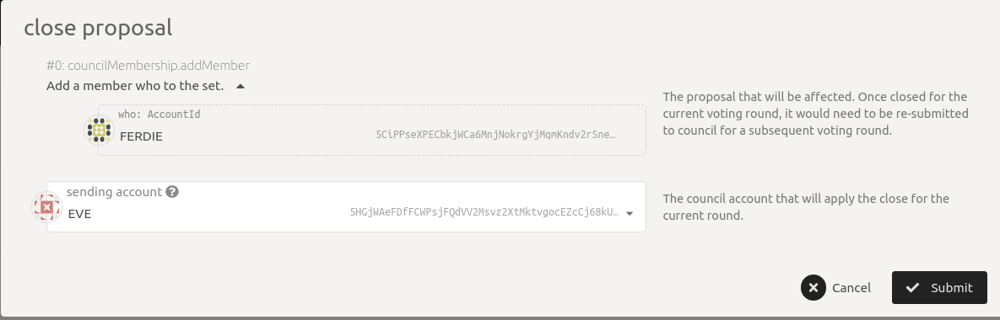
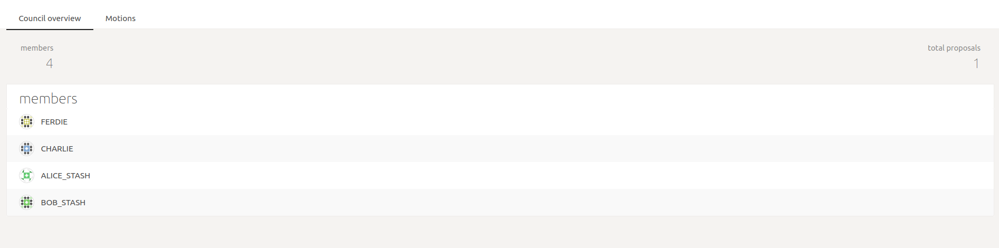
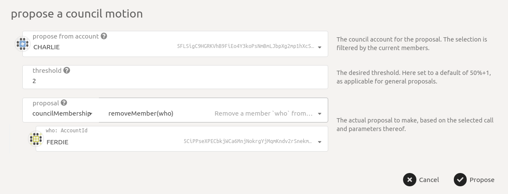

# Council

Council members can add new or remove existing Council members through voting. A simple majority, i.e. &gt;50% accepting votes by Council members are required to change Council membership.

Below we show how you can see the current Council members and also change Council membership along with screenshots. Note that the screenshots are for illustratory purposes only, and the actual data \(addresses, names, amounts, durations can be different\).

The current Council members can be seen at URL [https://fe.dock.io/\#/council](https://fe.dock.io/#/council) as shown below

### Council membership

To add a new Council member, go to [http://fe.dock.io/\#/council/motions](http://fe.dock.io/#/council/motions) and click on the **Propose motion** button. It will show a dialog box where you should select the `addMember` under `councilMembership` and select an account that you want to add to the Council. You need to ensure that the account being added is not already added to the Council else the proposal will be rejected; the UI does not prevent that. As shown below, Ferdie is being proposed to be added to the Council by existing member Charlie. Also, note that the `threshold` is set to 2 as there are only 3 Council members and 2 is &gt;50% of 3. Once the correct values have been set, click _Propose_ and then submit the transaction on the next screen.

Now you should the proposal as a motion. You can see the `votes` in addition to other data and also see there is 1 `Aye` \(positive vote\) already. This is because the proposer is assumed to accept the proposal. Below is an expanded view of the proposal showing exactly what was proposed which is the addition of Ferdie to the Council.

A council member can accept or reject the motion by voting `Aye` or `Nay` respectively. To do that click on the **Vote** button for the motion and you will see a dialog box shown below. There you can vote and then submit the transaction on the next block. Make sure that you are voting with account that is a Council member already, in the picture below, `BOB_STASH` is a Council member \(you can confirm from the above pictures\)

You can see the current votes, i.e. `Aye` vs `Nay` for each proposal and also the members who voted `Aye` or `Nay` for each proposal by expanding the row. The image below shows that the Motion to add "Ferdie" required 2 `Aye`s and has 2 `Aye`s \(2/2\).

Now that the Motion has had the required `Aye`s, it can be executed by closing it. It is done by clicking on the **Close** button. Closing can be done by any account and not just by Council members. The image below shows that a regular account "EVE" who is not a Council member is closing the proposal.

You can now go to the overview tab and see the new Council member. The image below shows "Ferdie" in the Council members list

You can also remove a Council member following a similar process of "Propose" -&gt; "Vote" -&gt; "Close". The image below shows "Charlie" trying to remove "Ferdie" from the Council.

