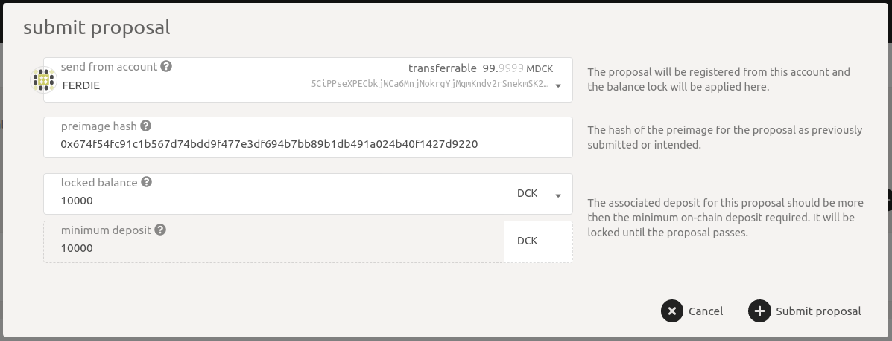

# Proposals

Token holders can propose changes by locking at least 1,000 tokens. Unless the proposal is canceled \(not rejected\), the holders get their locked tokens back. Other holders can also lock their tokens for a particular user's proposal.

There are two proposals in the queue  and every 20 days a proposal is considered and the Council will vote on the proposal. The voting lasts for 15 days and the members can vote aye \(yes\), nay \(no\) or abstain from voting. All votes carry equal weighting. If a proposal is accepted, it is _enacted_, meaning it takes effect in 2 days. However, the technical committee can fast-track the enactment in urgent cases. 

Another thing to note about the proposal process is that it happens in 2 steps for reducing on-chain storage and then also making it cheaper for proposers to propose. First, the proposal hash is submitted on-chain and then the expectation is that the proposer will share the actual proposal with the community off-chain like on forums. People can then compare the proposal with its on-chain hash and then express their opinion and may decide to back it with tokens as well, this backing is called `second`ing. People might not like the proposal and thus the proposer will understand that his proposal does not stand a chance to be approved and he will not publish the full proposal and thus take chain-storage and pay fees.

Current proposals will be publicly [here](https://fe.dock.io/#/democracy) and any Dock token holder will be able to make a new proposal from that page, more on that [here](proposals.md).

### Preparing a proposal

To create a proposal, we need to know its hash. For that navigate to [https://fe.dock.io/\#/master-proposals/create](https://fe.dock.io/#/master-proposals/create). Now select the change you want to propose and note down the "Proposal hash". The image below shows a proposal being created to increase the maximum allowed validators to be 18. You can ignore the proposal URL.

### Submitting a proposal

Now go to [https://fe.dock.io/\#/democracy](https://fe.dock.io/#/democracy) and click on **Submit proposal**. In the dialog box that appears, enter the proposal hash in the "preimage hash" field and enter a lockup amount greater than or equal to 1,000 tokens. The image below shows Ferdie using the previously generated proposal hash to make a proposal.

Once submitted, the proposal will be shown under "proposed by public" with the hash. The image below shows an example. ****The "0"  before the `preimage 0x67....h` is the proposal index and uniquely identifies the proposal.

Note that the above entry does not yet say what the proposal is, it only shows the hash. This is because the chain only knows the hash or the "image" of the proposal. To submit the actual proposal \("preimage"\) to the chain, click on **Preimage** button and enter the same proposal to submit as the preimage. The preimage can be submitted by anybody and does not have to be submitted by the original proposer. In the example below, note that "Eve" is submitting the preimage where Ferdie had submitted the hash \(see above\)

Once the preimage is submitted, notice how the proposal listing changes to show the full details of the proposal

Proposals can also be supported, i.e. seconded by others by locking the same amount of tokens as the proposer did by clicking on the **Second** button. The example below shows Eve seconding the proposal.

### Becoming a referendum

Once sufficient time has passed \(shown under "launch period" on the page\), the proposal becomes a referendum and is now ready to be voted upon by the token holders. The image below shows how the proposal has moved under "referenda". It also shows the expiry of the referendum under "remaining" and also that note that no voting has yet been done on it. Also, the "0" is the referendum index and uniquely identifies the referendum.

### Voting

Now the token holders can vote on the referendum by clicking on **Vote** with the balance they intend to support the vote with. The images below show that both Charlie and Bob\_Stash approve the proposal by clicking on **Vote Aye** and submitting the transaction. Note that they are voting on referendum index 0.

Once &gt;=66% of council members i.e. 3 out of 4 have approved the referendum, the referendum has a green tick meaning the referendum will now be executed but after some time. See the image below for an example

### Execution

Once the voting period has passed, the accepted referendum moves to the dispatch queue where it will be executed after some time. You can see the time remaining to execute under enact. Here also, the "0" specifies the referendum index.

**Note:** The time to launch referendum, do voting, enact passed referendum, etc have been shown in minutes and seconds according to the example images but in practice, these will be on the order of days. Similarly, for the minimum deposit, it is shown 10,000 but it can change over time.

