# Proposals

Token holders can propose changes by locking tokens above 10,000. However token holders cannot vote on them \(they can vote during PoS\), only Council members can. Unless the proposal is canceled \(not rejected\), the holders get their locked tokens back. Other holders can also lock their tokens for a particular user's proposal.

### Preparing a proposal

To create a proposal, we need to know its hash. For that navigate to [https://fe.dock.io/\#/master-proposals/create](https://fe.dock.io/#/master-proposals/create). Now select the change you want to propose and note down the "Proposal hash". The image below shows a proposal being created to increase the maximum allowed validators to be 18. You can ignore the proposal URL.

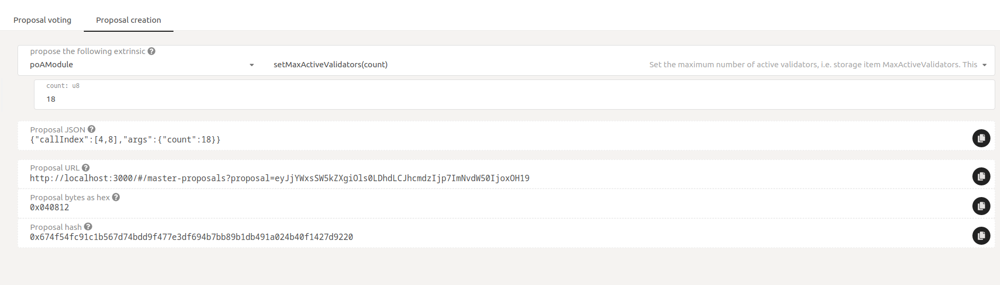

### Submitting a proposal

Now go to [https://fe.dock.io/\#/democracy](https://fe.dock.io/#/democracy) and click on **Submit proposal**. In the dialog box that appears, enter the proposal hash in the "preimage hash" field and enter a lockup amount greater than or equal to 10,000 tokens. The image below shows Ferdie using the previously generated proposal hash to make a proposal.

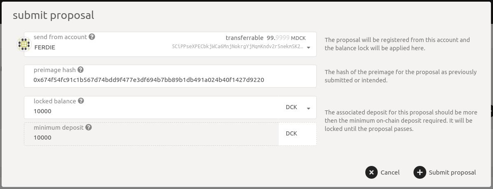

Once submitted, the proposal will be shown under "proposed by public" with the hash. The image below shows an example. ****The "0"  before the `preimage 0x67....h` is the proposal index and uniquely identifies the proposal.

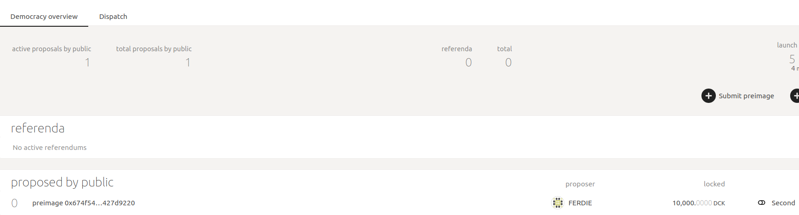

Note that the above entry does not yet say what the proposal is, it only shows the hash. This is because the chain only knows the hash or the "image" of the proposal. To submit the actual proposal \("preimage"\) to the chain, click on **Preimage** button and enter the same proposal to submit as the preimage. The preimage can be submitted by anybody and does not have to be submitted by the original proposer. In the example below, note that "Eve" is submitting the preimage where Ferdie had submitted the hash \(see above\)

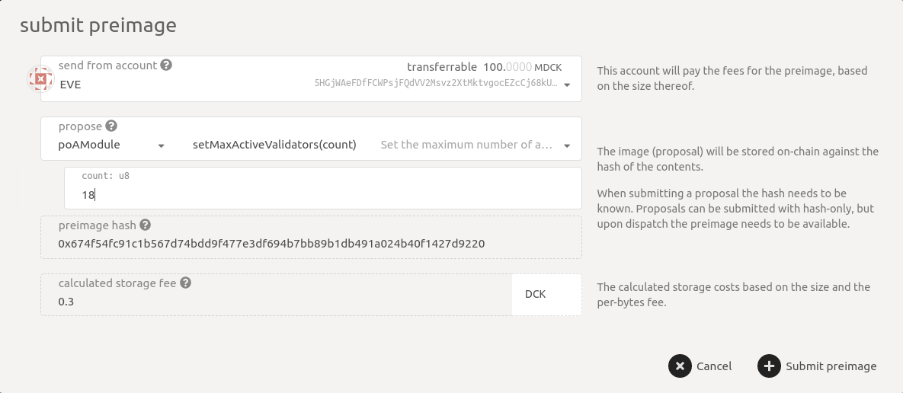

Once the preimage is submitted, notice how the proposal listing changes to show the full details of the proposal

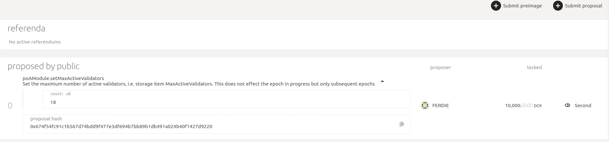

Proposals can also be supported, i.e. seconded by others by locking the same amount of tokens as the proposer did by clicking on the **Second** button. The example below shows Eve seconding the proposal.

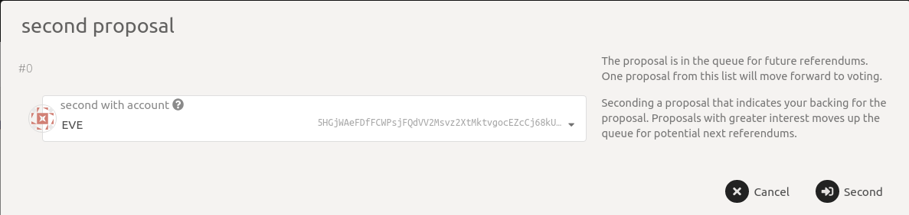

### Becoming a referendum

Once sufficient time has passed \(shown under "launch period" on the page\), the proposal becomes a referendum and is now ready to be voted upon by the Council. The image below shows how the proposal has moved under "referenda". It also shows the expiry of the referendum under "remaining" and also that note that no voting has yet been done on it. Also, the "0" is the referendum index and uniquely identifies the referendum.

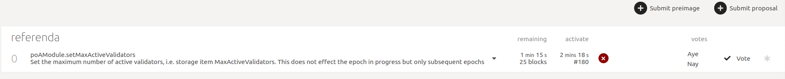

### Voting

Now the Council members can vote on the referendum by clicking on **Vote**. The images below show that both Charlie and Bob\_Stash approve the proposal by clicking on **Vote Aye** and submitting the transaction. Note that they are voting on referendum index 0.

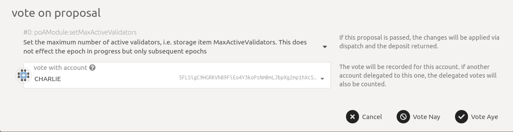

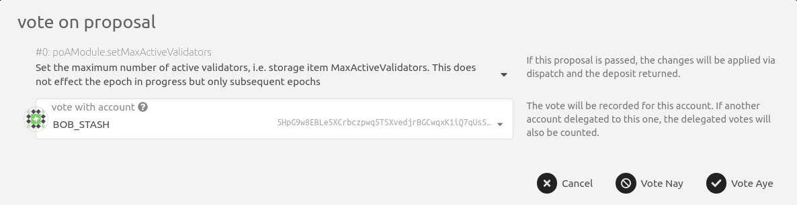

Once &gt;50% of council members i.e. 2 out of 3 have approved the referendum, the referendum has a green tick meaning the referendum will now be executed but after some time. See the image below for an example

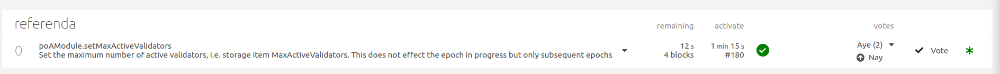

### Execution

Once the voting period has passed, the accepted referendum moves to the dispatch queue where it will be executed after some time. You can see the time remaining to execute under enact. Here also, the "0" specifies the referendum index.

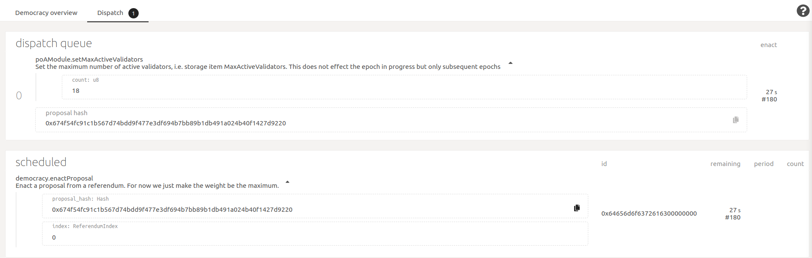

###  Canceling a proposal

Any Council member can cancel a proposal unilaterally thus slashing the locked deposit of the proposer and any others who have seconded that proposal. Council members are supposed to act responsibly and only cancel proposals that are definitely spam and meant to only waste one "launch period". A council member can submit such the `cancelProposal` by specifying the proposal index from here [https://fe.dock.io/\#/extrinsics](https://fe.dock.io/#/extrinsics). The example below shows council member "TEST1" canceling the proposal with index 0.

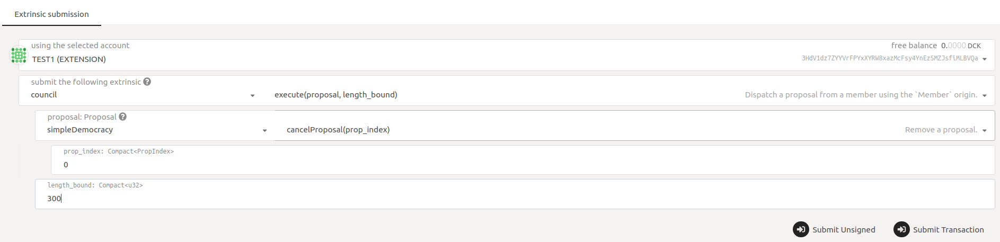

**Note:** The time to launch referendum, do voting, enact passed referendum, etc have been shown in minutes and seconds according to the example images but in practice, these will be on the order of days. For the exact values, refer to the main PoA-2 governance docs.

