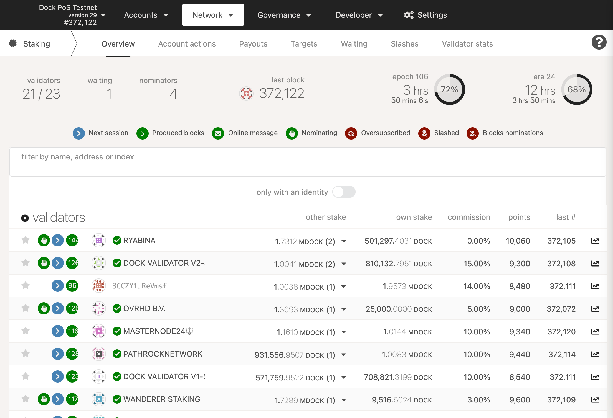

# Staking & Nominating

Nominators can help to secure the Dock Chain and earn passive income by selecting good validators and staking DOCK tokens. Nominators can earn DOCK by nominating one or more validators.

Nominators that select to stake for well-behaved validators will share in the staking rewards that they generate. However, should a nominator select a validator that does a poor job your DOCK is at risk as they could get slashed and the nominator will lose their DOCK. 

New validators are elected for an era, which is a duration of 12 hours. Validators for an era are elected 2 eras before, i.e validators running in era 10 were elected in era 8. Along with validators, related parameters like stake, commission, whether to allow more nominations, etc are fixed as well during the election. Eg if a validator changes the commission from 10% to 20% in era 10, the 20% commission won't be applicable in era 11 but era 12; for era 11 the commission will remain 10% since validators for era 11 were elected in era 9 where the commission was 10%. Similarly for nominators, when their nominees are effective after eras. eg If a nominator nominates validators _A_, _B_, and _C_ in era 10, the nominator's funds will be locked in era 10, but they will count toward validators _A_, _B_, and _C_ in era 12. If the nominators removes _C_ from his nominees in era 15, his locked funds will contribute towards _C_ in era 16 but in era 17, they will contribute towards _A_ and _B_ only. 

While your DOCK is staked by nominating a validator, they are 'locked' \(bonded\). You can receive new DOCK in your account but you cannot use your bonded DOCK to stake as validator or transfer it out of your account. You can un-nominate at any time to stop staking your funds. Keep in mind that the un-nomination is effective in the next to next era, and that un-nominating does not automatically unbond your funds. The unbonding period is 7 days before bonded funds can be transferred further to issuing an unbond transaction.

**Oversubscribed Validators**

Validators can only pay out to a certain number of nominators per era. This is currently set to 256, but can be modified via governance. If more than 256 nominators nominate the same validator, it is considered ‘oversubscribed’, and only the top 256 staked nominators \(ranked by amount of stake\) are paid rewards. Other nominators will receive no rewards for that era, although their stake will still be used to calculate entry into the active validator set.

Although it is difficult to determine exactly how many nominators will nominate a given validator in the next era, you can make an educated guess based on the current number of nominators. A validator with only 5 nominators in this era, for instance, is unlikely to have more than 256 in the next era. An already-oversubscribed validator with 1000 nominators this era, however, is very likely to be oversubscribed in the next era as well.

**Elimination of Nominators**

Determining which validators are in the active set and which nominators are nominating them creates a very large graph mapping nominators to their respective validators. This "solution set" is computed off-chain and submitted to the chain, which means it must fit in a single block. If there are a large number of nominators, this means that some nominators must be eliminated. Currently, nominators are sorted by amount of DOCK staked and those with more DOCK are prioritized. This means that if you are staking with a small amount of DOCK, you may not receive rewards. This minimal amount is dynamic based on the number of validators, number of nominators, amount nominated, and other factors.  

**Receiving Rewards**

As long as you have nominated more than one validator candidate, and at least one of them got elected, and you are nominating with enough stake to get into the solution set, your bonded stake will be fully distributed to one or more validators. That being said, you may not receive rewards if you nominated validators who weren't selected, or if your stake is small and you only selected oversubscribed validators, or if the validator you are nominating has 100% commission. It is generally wise to choose as many trustworthy validators as you can \(up to 16\) to reduce the risk of none of your nominated validators being elected.

Rewards are lazy - somebody must trigger a payout for a validator for rewards to get all of the validator's nominators. Any account can do this, although in practice validator operators often do this as a service to their nominators. See the page on Simple Payouts for more information and instructions for claiming rewards.

**Considerations for Nominators**

One thing to keep in mind as a nominator is the validator's commission. The commission is the percentage of the validator reward which is taken by the validator before the rewards are split among the nominators. As a nominator, you may think that the lowest commission is best. However, this is not always true. Validators must be able to run at break-even in order to sustainably continue operation. Independent validators that rely on the commission to cover their server costs help to keep the network decentralized. Commission is just one piece of the puzzle that you should consider when picking validators to nominate.

As a nominator, if you only want to know the profit each validator made for each era, you can go to the Targets section under the staking page by inputting the number of tokens you would like to stake to check it. Then, nominate those who have a higher profit. However, that does not guarantee the right way to evaluate the validators' overall performance.

Within the same page \(Targets\) you can filter prospective validators by the following traits to help narrow down your selection. The traits are:

* Single from operator - Do not show groups of validators run by a single operator.
* No 20%+ comm - Do not show any validators with a commission of 20% or higher.
* No at capacity - Do not show any validators who are currently operating at capacity \(i.e. they could potentially be oversubscribed\).
* Recent payouts - Only show validators that have recently caused a payout to be issued. Note that anyone can cause a payout to occur; it does not have to be the operator of a validator.
* Only elected - Only show validators that are currently in the active set \(i.e., they have been elected to produce blocks this era\).
* Only with an identity - Only show validators that have set an identity. Note that this identity does not have to be verified by a registrar for the validator to show up in the list.

  
  
  

