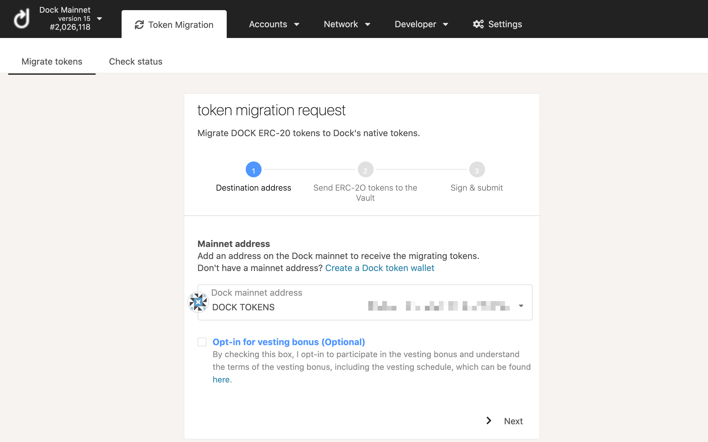
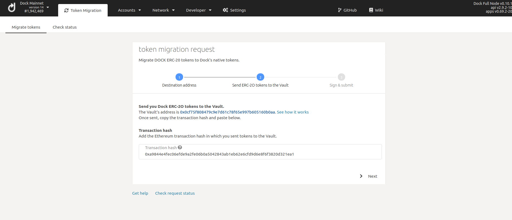
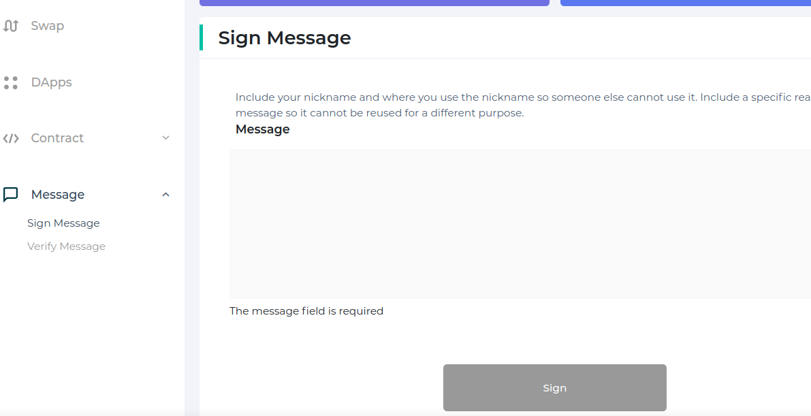
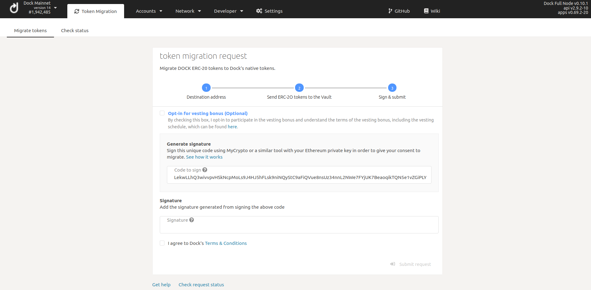

# Token Migration Tutorial


Dock has officially completed the token migration as of **March 31, 2021**. Any questions can be sent to [support@dock.io](mailto:support@dock.io).



_**Stay safe -** be very careful when migrating your tokens to follow directions and check all addresses and website URLs to ensure you are migrating correctly.  Unfortunately, migration events are targets for scammers we will not be able to return tokens that are not migrated correctly._


### Step 1: Create new Dock account

You will need to create a Dock account using an application or wallet that supports the new token. Several easy-to-use wallets are available including a web application, browser extension available for Chrome and Firefox, and a mobile app. A list of wallets supporting the new Dock token as well as steps to create a new Dock account can be found [here](https://docs.dock.io/token-migration/migration-tutorial/wallets-and-account-creation).

### Step 2: Send ERC20 tokens to Vault

Use any ERC20 compatible wallet such as [metamask](https://metamask.io/) or [mycrypto](http://mycrypto.com/) to send your Dock tokens to the vault address: **0x0cf75F808479C9e7D61C78F65E997b605160B0AA**

The vault address is also posted on the Dock [website](https://www.dock.io/token-migration) \(step 2\) and on our official [Twitter](https://twitter.com/docknetwork). _**Double-check you are sending to the correct address, if you send your tokens to another address then we will not be able to recover them.**_

\*\*\*\*

Save the transaction hash or use [etherscan](https://etherscan.io/) to find it by looking up your wallet address.

### Step 3: Sign message with Ethereum address

Go to Dock's Token Migration portal to complete the migration. First you will need to select the destination address, which is the new Dock token account you created in Step 1.

By migrating during the first five weeks, you will automatically receive a swap bonus and will have the option to opt-in to the vesting bonus. You can learn more about the bonuses [here](https://blog.dock.io/dock-token-migration-part-2-incentives/).

Then enter the Ethereum transaction hash provided when sending your tokens in Step 2 and click Next.

You will then receive a code \(series of characters\) to use for signing. Go to [My Crypto](https://mycrypto.com/) and click on Tools &gt; Sign & Verify Message. After unlocking your Ethereum wallet, enter the code for signing into the Message box and click Sign Message. Then copy the “sig” value from the Signature box, this is what you will need for the next step.

You can also use [MyEtherWallet](https://www.myetherwallet.com/) \(MEW\) to sign the code. After connecting your wallet like Ledger, Metamask, etc, go to the [sign message page](https://www.myetherwallet.com/interface/sign-message) and paste the code in the "Message" box as shown below

### Step 4: Migrate your tokens

 Go back to the Token Migration page and paste the "sig" code under Signature, then click Submit. If successful, you will see a message in green that the migration is being processed.

### Community Support

Our team is available to help throughout the token migration and can be contacted at [support@dock.io](mailto:support@dock.io) or on our [Telegram channel](https://t.me/dockio).



