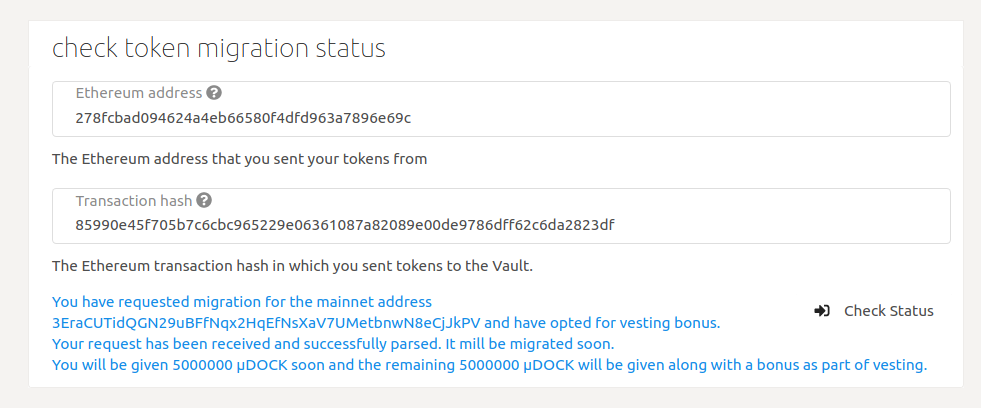
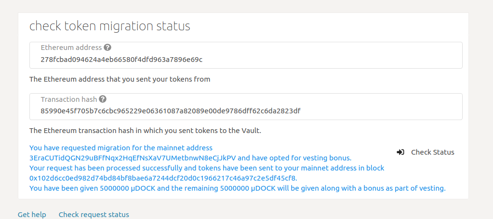
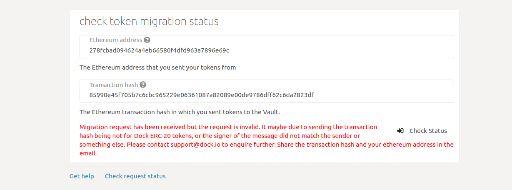

# Token Migration Status

## Checking the request status

If you have migrated, then you can check the status of your request [here](https://fe.dock.io/#/token-migration/status). Enter the Ethereum address you used to send the ERC-20 transaction and sign the code and the ERC-20 transfer's transaction hash. 

Once you submit the form, you will see the status information on the same page. Request processing takes time and it can take from a few minutes to hours \(under extreme load\). 

Following are some of the statuses you can see.  We have used dummy data in the images below.

**If you just submitted the request successfully but did not opt for bonus.**

\*\*\*\*

**If you just submitted the request successfully and opted for bonus**

**If** **you opted for bonus and your request was processed successfully but we are waiting for sufficient confirmations of your Ethereum transaction. You can see the amount that will be given to you after confirmation and the amount that will be vested. The vesting bonus will be determined once the bonus window closes. To know more about the swap and vesting bonus, check our** [**blog post**](https://blog.dock.io/dock-token-migration-part-2-incentives/)**.**

**If** **you have not opted for bonus and your request was processed successfully but we are waiting for sufficient confirmations of your Ethereum transaction. Notice the status mentiond amount of tokens that will be given.**

**If you have opted for bonus and the migration is done. Notice the amount of token migrated and the remaining that are locked for vesting. Also notice the mainnet block hash for the migration, you can look up the block by searching for the block hash in the search box at the top right of the** [**explorer**](https://fe.dock.io/#/explorer)**.**

**If you have not opted for bonus and the migration is done. Notice the amount of token migrated, reamaining for vesting, and mainnet block hash.**

**In case the migration request was not processed successfully,  you will see the response in red color.**

## Checking the bonus balance

The given bonus, including the vested amount if opted for, can be seen as the "reserved" part of the balance. To check the bonus amount, the mainnet address needs to be added to [https://fe.dock.io](https://fe.dock.io/#/addresses), either as an account or a contact by using **Add contact** button on [https://fe.dock.io/\#/addresses](https://fe.dock.io/#/addresses). Once the account is added, click on the down arrow near the balance and you will see bonus amount in front of "reserved". In the example below, you can see the account has total balance of 30,499.8555 tokens, out of which 27,982.0000 tokens are transferrable and 2,517.8555 tokens is the bonus amount.

The name "reserved" is due to the fact that for bonus locking, we use Substrate's "reserve" feature.

