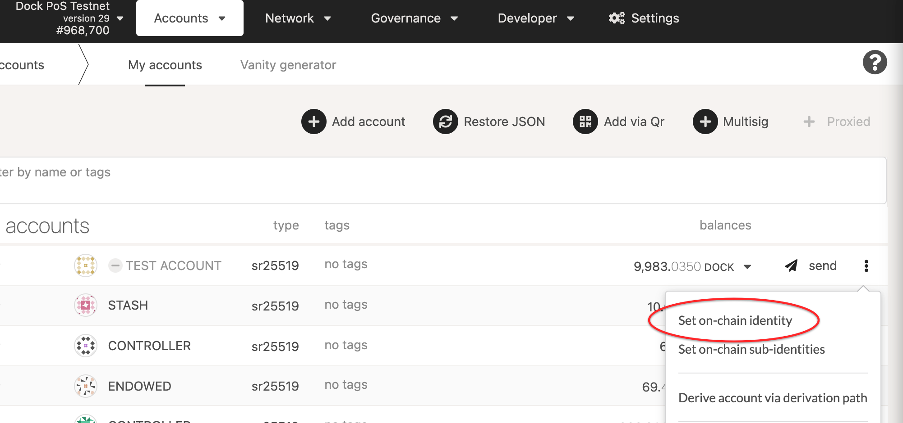

# Identity Setup

Dock provides a naming system that allows participants to add personal information to their on-chain account and subsequently ask for verification of this information by registrars. It is strongly recommended that validators create identities for stash accounts.

Users can set an identity by registering through default fields such as legal name, display name, website, Twitter handle, Riot handle, etc. along with some extra, custom fields for which they would like attestations \(see Judgements\).

Users must reserve funds in a bond to store their information on chain: 20.258, and 0.066 per each field beyond the legal name. These funds are locked, not spent - they are returned when the identity is cleared. These amounts can also be extracted by querying constants through the Chain state constants tab on the [DOCK-JS App](https://fe.dock.io/#/chainstate/constants).

The easiest way to add the built-in fields is to click the three dot icon next to your account and select "Set on-chain identity".

The other options is to follow the steps below:  
1. Go to the Developer tab and select Chain state

2. Next, select identity as the selected constant query.

3. Then on the right-hand side, you can select the constants that you would like to view and add them onto the webpage by clicking the "plus" icon at the end of the bar. Each field can store up to 32 bytes of information, so the data must be less than that.

When inputting the data manually through the Extrinsics UI, a UTF8 to bytes converter can help. 

4. A popup will appear, offering the default fields.

To add custom fields beyond the default ones, use the Extrinsics UI to submit a raw transaction by first clicking "Add Item" and adding any field name you like. The example below adds a field steam, which is a user's Steam username. The first value is the field name in bytes \("steam"\) and the second is the account name in bytes \("theswader"\). The display name also has to be provided, otherwise, the Identity pallet would consider it wiped if we submitted it with the "None" option still selected. That is to say, every time you make a change to your identity values, you need to re-submit the entire set of fields: the write operation is always "overwrite", never "append".

Note that custom fields are not shown and  only show official fields for now. If you want to check that the values are still stored, use the Chain State UI to query the active account's identity info.

### **Format Caveat**

Please note the following caveat: because the fields support different formats, from raw bytes to various hashes, a UI has no way of telling how to encode a given field it encounters. The Dock UI currently encodes the raw bytes it encounters as UTF8 strings, which makes these values readable on-screen. However, given that there are no restrictions on the values that can be placed into these fields, a different UI may interpret them as, for example, IPFS hashes or encoded bitmaps. This means any field stored as raw bytes will become unreadable by that specific UI. As field standards crystallize, things will become easier to use but for now, every custom implementation of displaying user information will likely have to make a conscious decision on the approach to take, or support multiple formats and then attempt multiple encodings until the output makes sense.  

