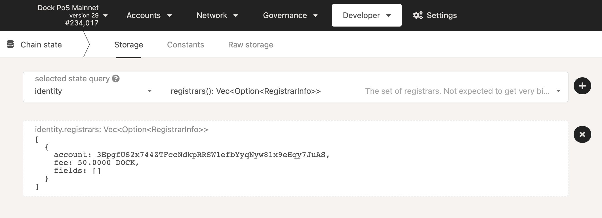

# Dock Registrar

There is currently one Registrar provided by Dock: 

3EpgfUS2x744ZTFccNdkpRRSW1efbYyqNyw81x9eHqy7JuAS

To find out how to contact the registrar after the application for judgement or to learn who they are, we can check their identity by adding them to our Address Book. Their identity will be automatically loaded.

