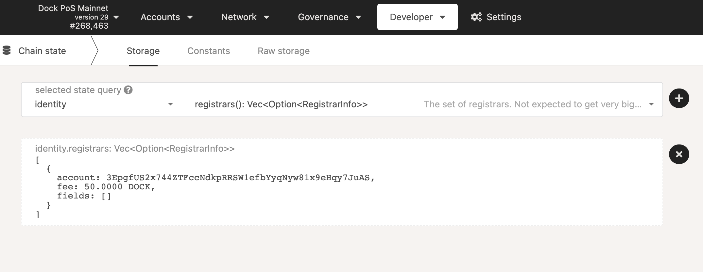

# Judgements

After a user injects their information on-chain, they can request judgement from a registrar which verifies their on-chain identity. This is highly recommend for validators to gain credibility in the Dock network. The identity fields that can be submitted for judgement include legal name, email, website, Twitter handle and Riot handle.

### Submitting a judgement

Prior to submitting a judgement, you will need to complete your identity setup by following the steps [here](https://docs.dock.io/validators/identity-setup).

Once your identity details are added on-chain, go to the [Extrinsics UI](https://fe.dock.io/#/extrinsics) and select the identity pallet, then requestJudgement. For the reg\_index put the index of the registrar you want to be judged by, and for the max\_fee put the maximum you're willing to pay for these confirmations.

The registrar index is the position of each registrar in the list of registrars, i.e. 1st position will be index 0, 2nd position will be index 1, etc. The list can be viewed by going to the [Chain State UI](https://fe.dock.io/#/chainstate) and querying "identity" &gt; "registrars".

Declare a maximum fee that they are willing to pay for judgement, and registrars whose fee is below that amount can provide a judgement.

When a registrar provides judgement, they can select up to six levels of confidence in their attestation:

* **Unknown**: The default value, no judgement made yet.
* **Reasonable**: The data appears reasonable, but no in-depth checks \(e.g. formal KYC process\) were performed.
* **Known Good**: The registrar has certified that the information is correct.
* **Out of Date**: The information used to be good, but is now out of date.
* **Low Quality**: The information is low quality or imprecise, but can be fixed with an update.
* **Erroneous**: The information is erroneous and may indicate malicious intent.

A seventh state, "fee paid", is for when a user has requested judgement and it is in progress. Information that is in this state or "erroneous" is "sticky" and cannot be modified; it can only be removed by complete removal of the identity.

### Cancelling Judgements

You may decide that you do not want to be judged by a registrar \(for instance, because you realize you entered incorrect data or selected the wrong registrar\). In this case, after submitting the request for judgement but before your identity has been judged, you can issue a call to cancel the judgement using an extrinsic.

To do this, first, go to the [Extrinsics UI](https://fe.dock.io/#/extrinsics) and select the identity pallet, then cancelRequest. Ensure that you are calling this from the correct account \(the one for which you initially requested judgement\). For the reg\_index, put the index of the registrar from which you requested judgement.

Submit the transaction, and the requested judgement will be cancelled.  

