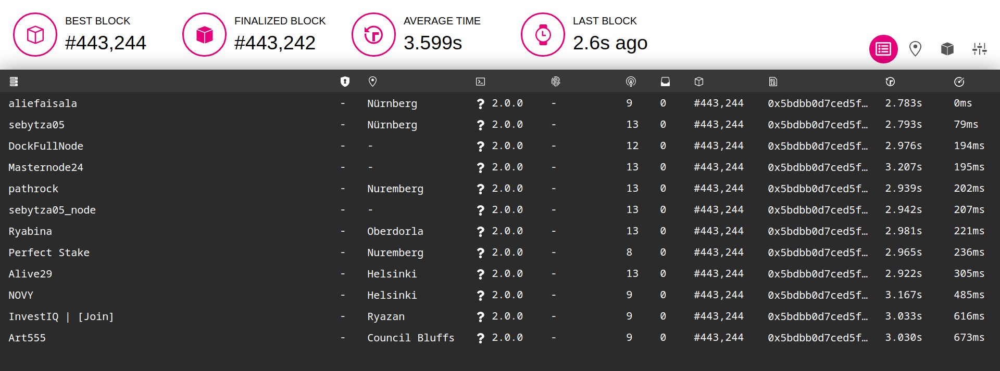
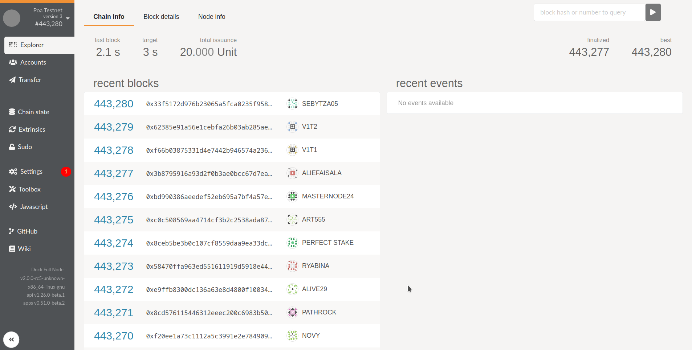

# PoA

The nodes currently running in the PoA testnet can be seen at the [Polkadot telemetry](https://telemetry.polkadot.io/#list/Poa%20Testnet). 

Our fork of Polkadot-js apps showing block explorer and other tools is [here](https://fe.dock.io/). You can notice the validators producing blocks in a round-robin fashion in the [explorer](https://fe.dock.io/#/explorer).





