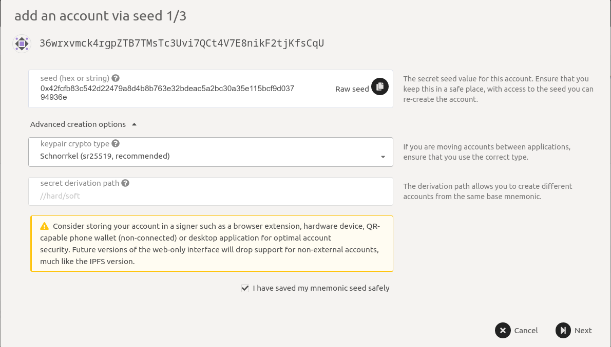
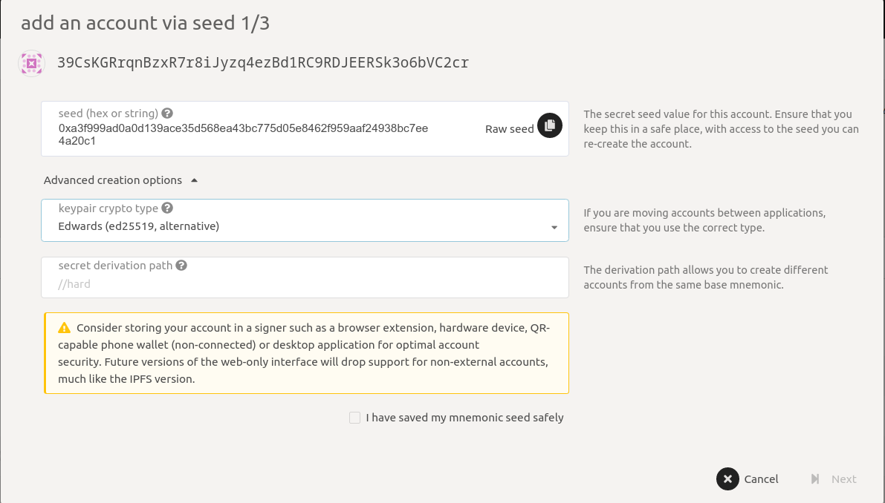
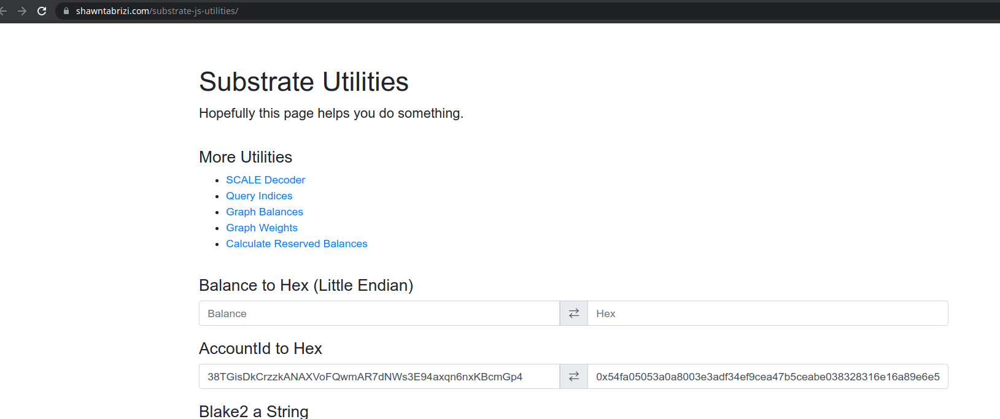

# Genesis validators

### Overview

Genesis validators need to generate keys as described below. We will then update the genesis file with those keys and publish the new genesis file which must be used to run the node. The genesis validators will then run a new node built with the PoS code and the new genesis file and then insert the keys to make the node start producing blocks.

### Generating keys

For being a validator, 6 keypairs are needed. 

1. Keypair for _stash_ account which receives staking rewards and locks its funds. This account should be kept with maximum security like in cold storage. 

2. Keypair for _controller_ account to set validator preferences like session key, commission, etc. This account should have a sufficient balance to make transactions \(~300 tokens as of now\) 

3-6. The remaining 4 keys are for _Babe_, _Grandpa_, _ImOnline_**,** and _Authority Discovery_. These are not accounts in the usual sense and they don't need to have a balance but are used by the validator to sign blocks, vote on blocks, health check, etc and thus their private keys must be present on the validator machine; the process is described later. The 4 keys are together called the _session key_.

The genesis validators should share the 6 above-mentioned keys \(accounts\) with us so that we can prepare the genesis spec. We recommend using the current \(PoA\) validator account as stash but if you need to use another account, ensure that 1000 tokens. Controller account can be created by going to the accounts page [here](https://fe.dock.io/?rpc=wss%3A%2F%2Fdanforth-1.dock.io#/accounts). The remaining 4 accounts should also be created from the accounts page but those must be of specific types. Keys for Babe, ImOnline, and Authority Discovery **must** be of type _Schnorrkel \(Sr25519\)_ and Grandpa **must** be of type _ed25519_. Check the screenshots below for reference.





Save the seed \(or phrase\) for each account as it will be used later.

Share the accounts for each of the 4 keys with us. eg, in the above screenshots, `36wrxv...` and `39CsKG...` should be shared with us. Also indicate, what accounts are for what purpose.

### Inserting keys in the validator 

_Note: ****This should only be done once you are running the node built by PoS code with the commit hash we tell you._

The keys generated above need to be inserted in the validator. For this you need to make RPC calls to the running validator which should be possible anyway if you are on the same machine. The calls are made with [curl](https://curl.se/) so make sure you have that installed. For each of the 4 keypairs \(Babe, Grandpa, etc\), get their hex public key. One way to generate it is from the corresponding account by going to [this page](https://www.shawntabrizi.com/substrate-js-utilities/) and entering the account in **AccountId to Hex** text box and getting the public key. For example, getting the hex public key from account "38TGisDkCrzzkANAXVoFQwmAR7dNWs3E94axqn6nxKBcmGp4" will give "0x54fa05053a0a8003e3adf34ef9cea47b5ceabe038328316e16a89e6e56408770" as shown in screenshot below.



Once you have the seeds and public keys, make the RPC call `author_insertKey` with appropriate arguments to insert them in _the_ validator. The first parameter of the call indicates what kind of key it is. 

```text
"babe" -> Babe 
"gran" -> Grandpa 
"imon" -> ImOnline 
"audi" -> Authority Discovery
```

An example is shown below where I have the same seed for all 4 accounts thus the public key is the same for all except Grapndpa as it uses a different algorithm \(eddsa\). It is a single curl call to insert 4 keys in the validator.

```text
curl http://localhost:9933 -H "Content-Type:application/json;charset=utf-8" -d \
  '[
  {
    "jsonrpc":"2.0",
    "id":1,
    "method":"author_insertKey",
    "params": [
      "babe",
      "0xfb5046029fe9ba10ecb454b1ca4f4d629a61653da79bf84b36010c98cfdfdb55",
      "0x00613e0b8e98ddc7f6ae94b64f240e61cda9cb9a619cc7b8e25d7465cf52a47a"
    ]
  },
  {
    "jsonrpc":"2.0",
    "id":2,
    "method":"author_insertKey",
    "params": [
      "gran",
      "0xfb5046029fe9ba10ecb454b1ca4f4d629a61653da79bf84b36010c98cfdfdb55",
      "0x9bdfcfce37814238ec638cb4c9cb5f7b8f1524a40678a1ac463ea7a8f33fbc97"
    ]
  },
  {
    "jsonrpc":"2.0",
    "id":1,
    "method":"author_insertKey",
    "params": [
      "imon",
      "0xfb5046029fe9ba10ecb454b1ca4f4d629a61653da79bf84b36010c98cfdfdb55",
      "0x00613e0b8e98ddc7f6ae94b64f240e61cda9cb9a619cc7b8e25d7465cf52a47a"
    ]
  },
  {
    "jsonrpc":"2.0",
    "id":1,
    "method":"author_insertKey",
    "params": [
      "audi",
      "0xfb5046029fe9ba10ecb454b1ca4f4d629a61653da79bf84b36010c98cfdfdb55",
      "0x00613e0b8e98ddc7f6ae94b64f240e61cda9cb9a619cc7b8e25d7465cf52a47a"
    ]
  }
   ]'
```

The keys in the above example are as follows:   
**Babe**   
    Seed - _0xfb5046029fe9ba10ecb454b1ca4f4d629a61653da79bf84b36010c98cfdfdb55_   
    Public key - _0x00613e0b8e98ddc7f6ae94b64f240e61cda9cb9a619cc7b8e25d7465cf52a47a_   
**Grandpa**   
    Seed - _0xfb5046029fe9ba10ecb454b1ca4f4d629a61653da79bf84b36010c98cfdfdb55_   
    Public key - _0x9bdfcfce37814238ec638cb4c9cb5f7b8f1524a40678a1ac463ea7a8f33fbc97_   
**ImOnline**   
    Seed - _0xfb5046029fe9ba10ecb454b1ca4f4d629a61653da79bf84b36010c98cfdfdb55_   
    Public key - _0x00613e0b8e98ddc7f6ae94b64f240e61cda9cb9a619cc7b8e25d7465cf52a47a_   
**Authority Discovery**   
    Seed - _0xfb5046029fe9ba10ecb454b1ca4f4d629a61653da79bf84b36010c98cfdfdb55_   
    Public key - _0x00613e0b8e98ddc7f6ae94b64f240e61cda9cb9a619cc7b8e25d7465cf52a47a_

Once the keys are inserted, restart the node.

In case you generate accounts with seed phrases, you can use them in place of seed as shown below

```text
curl http://localhost:9933 -H "Content-Type:application/json;charset=utf-8" -d \
  '[{
    "jsonrpc":"2.0",
    "id":1,
    "method":"author_insertKey",
    "params": [
      "babe",
      "file upper fever fog achieve side catalog flash age bright mirror split",
      "0x00613e0b8e98ddc7f6ae94b64f240e61cda9cb9a619cc7b8e25d7465cf52a47a"
    ]
  },
  {
    "jsonrpc":"2.0",
    "id":2,
    "method":"author_insertKey",
    "params": [
      "gran",
      "file upper fever fog achieve side catalog flash age bright mirror split",
      "0x9bdfcfce37814238ec638cb4c9cb5f7b8f1524a40678a1ac463ea7a8f33fbc97"
    ]
  },
  {
    "jsonrpc":"2.0",
    "id":1,
    "method":"author_insertKey",
    "params": [
      "imon",
      "file upper fever fog achieve side catalog flash age bright mirror split",
      "0x00613e0b8e98ddc7f6ae94b64f240e61cda9cb9a619cc7b8e25d7465cf52a47a"
    ]
  },
  {
    "jsonrpc":"2.0",
    "id":1,
    "method":"author_insertKey",
    "params": [
      "audi",
      "file upper fever fog achieve side catalog flash age bright mirror split",
      "0x00613e0b8e98ddc7f6ae94b64f240e61cda9cb9a619cc7b8e25d7465cf52a47a"
    ]
  }]'
```

The seed phrase above was "file upper fever fog achieve side catalog flash age bright mirror split"

